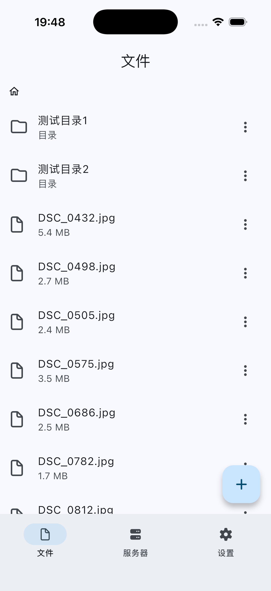
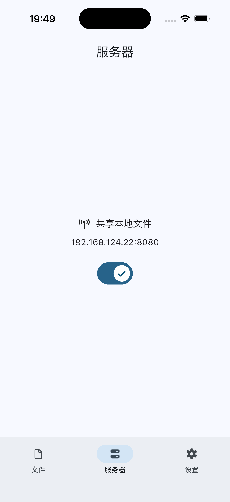
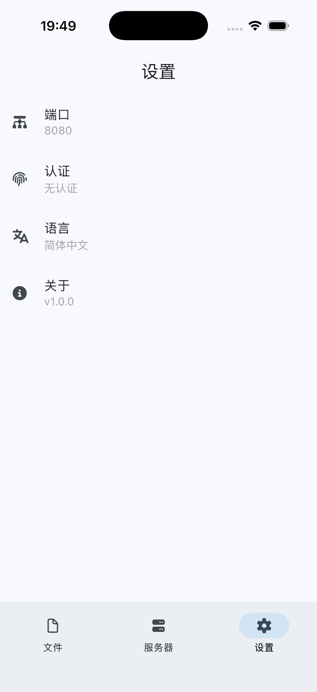

# Sharer Mobile

Also available in English. Click [HERE](/documents/en.md) to view the English version of the README

## 简介

这是[Sharer App](https://github.com/Zhoucheng133/Sharer-App)的移动端版本，可以将你的移动设备作为一个服务器，在局域网内用各种设备通过网页访问

**支持Android设备和iOS设备**，如果你要查找桌面版本，应该访问[Sharer App](https://github.com/Zhoucheng133/Sharer-App)仓库

[**Sharer**](https://github.com/Zhoucheng133/Sharer-App) | **★ Sharer Mobile**

核心组件在这里：[Sharer-Core](https://github.com/Zhoucheng133/Sharer-Core)  
前端页面在这里：[Sharer-Web](https://github.com/Zhoucheng133/Sharer-Web)

> [!NOTE]
> 本App不需要连接互联网，但是在一些设备上需要授权使用无线局域网才能启动服务器

## 截图

### App

### 页面

## 在你的设备上构建

如果你需要手动构建Sharer-Core的动态库/静态库（在iOS上使用静态库，Android版本则是动态库），你可以前往[Sharer-Core的仓库页面](https://github.com/Zhoucheng133/Sharer-Core)查看

你需要在你的设备上安装Flutter (本项目使用的Flutter `3.41`)

构建的动态库/静态库位于`ios/libserver.xcframework`和`android/app/src/main/jniLibs/arm64-v8a`