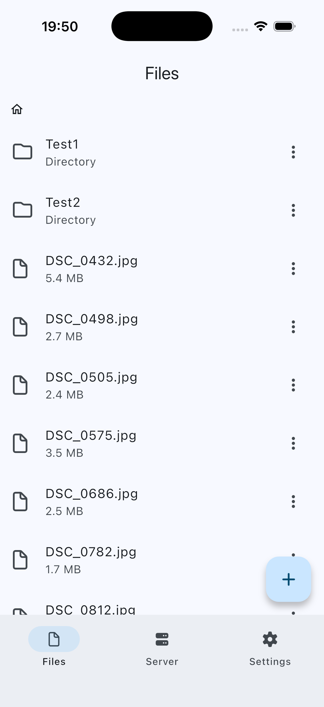
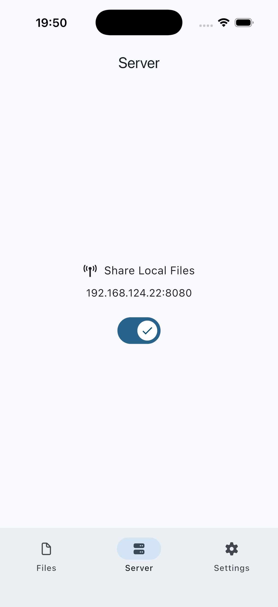
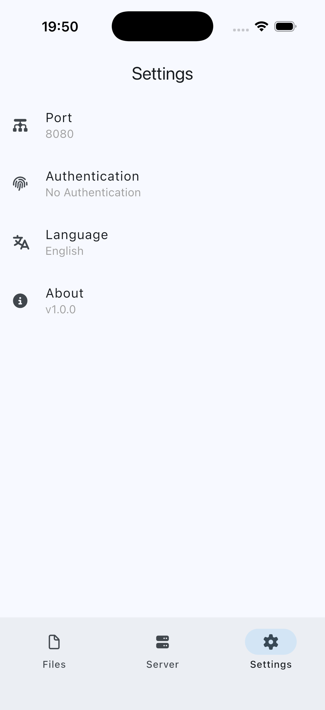

# Sharer Mobile

## Introduction

This is the mobile version of [Sharer App](https://github.com/Zhoucheng133/Sharer-App), which lets you use your mobile device as a server, allowing various devices on the local network to access it through a web browser.

**Supports both Android and iOS devices.** If you're looking for the desktop version, please visit the [Sharer App](https://github.com/Zhoucheng133/Sharer-App) repository.

[**Sharer**](https://github.com/Zhoucheng133/Sharer-App) | **★ Sharer Mobile**

Core component: [Sharer-Core](https://github.com/Zhoucheng133/Sharer-Core)  
Frontend page: [Sharer-Web](https://github.com/Zhoucheng133/Sharer-Web)

> [!NOTE]
> This app does NOT require an internet connection, but on some devices, authorization to use Wi-Fi is required to start the server.

## Screenshots

### App

### Page

## Build on Your Device

If you need to manually build the dynamic/static library for Sharer-Core (static library on iOS, dynamic library on Android), you can visit the [Sharer-Core repository page](https://github.com/Zhoucheng133/Sharer-Core) for instructions.

You need to have Flutter installed on your device (this project uses Flutter `3.41`).

The built dynamic/static libraries are located at `ios/libserver.xcframework` and `android/app/src/main/jniLibs/arm64-v8a`.